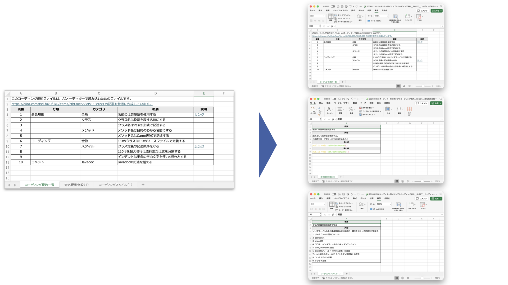

# excel-splitter

[English](./README.md) | [日本語](./README_ja.md)

[](https://elvez.co.jp/)
[](https://elvez.co.jp/ixv/)
[](https://opensource.org/licenses/MIT)
[](https://www.python.org/)
[](https://github.com/elvezjp/excel-splitter/stargazers)

A Python CLI tool for splitting Excel files. Splits multiple sheets into individual files and automatically converts inter-sheet hyperlinks to external file links.



## Use Cases

- **Splitting Large Excel Files**: Split large Excel files by sheet or by row count
- **Efficient File Sharing**: Extract and share only the sheets you need
- **Data Migration**: Split Excel files when migrating data between systems
- **Backup**: Save each sheet as an individual file

## Background

This tool was created during the development of **IXV**, an AI development ecosystem designed for Japanese engineering teams.

IXV delivers a methodology and OSS that put AI to practical use in real development workflows. This repository publishes a portion of that work.

## Features

- **Sheet Splitting**: Split Excel files with multiple sheets into one file per sheet
- **Row Splitting**: Split large sheets into multiple files using the `--max-rows` option
- **Hyperlink Preservation**: Automatically converts inter-sheet links to external file links after splitting
- **Format Preservation**: Maintains original styles and formatting as much as possible using the "delete other sheets" method
- **Dry Run**: Preview split results without actually writing files using `--dry-run`

## Documentation

- [CHANGELOG.md](CHANGELOG.md) - Version history
- [CONTRIBUTING.md](CONTRIBUTING.md) - How to contribute
- [SECURITY.md](SECURITY.md) - Security policy
- [spec.md](spec.md) - Technical specification
- [docs/examples/](docs/examples/) - Sample input/output

## Setup

### Requirements

- Python 3.10 or higher
- [uv](https://docs.astral.sh/uv/) package manager

### Installing uv

```bash
# macOS / Linux
curl -LsSf https://astral.sh/uv/install.sh | sh

# Windows (PowerShell)
powershell -ExecutionPolicy ByPass -c "irm https://astral.sh/uv/install.ps1 | iex"
```

### Installing Dependencies

```bash
git clone https://github.com/elvezjp/excel-splitter.git
cd excel-splitter
uv sync
```

## Usage

```bash
uv run excel-splitter [OPTIONS] INPUT_FILE
```

### Basic Example

```bash
# Split by sheet (output to: ./dist)
uv run excel-splitter input.xlsx
```

### More Examples

```bash
# Specify output directory
uv run excel-splitter input.xlsx -o output/

# Split with row limit (max 50000 data rows per sheet)
uv run excel-splitter input.xlsx --max-rows 50000 -o output/

# Dry run (preview split results without creating files)
uv run excel-splitter input.xlsx --dry-run

# Run with verbose logging
uv run excel-splitter input.xlsx --verbose -o output/
```

### Try with Sample File

A sample Excel file is provided for testing. This file contains multiple sheets, styles, and hyperlinks, allowing you to verify all major features.

```bash
uv run excel-splitter "docs/examples/シート分割サンプル.xlsx" -o dist
```

### Important Notes

- **Cross-sheet references**: Formulas (e.g., `=Sheet2!A1`) and chart data sources referencing other sheets will lose their references after splitting
- **Shapes and images during row splitting**: Shapes and images are lost in sheets where row splitting (`--max-rows`) occurs

## Main Options

| Option | Default | Description |
|:---|:---:|:---|
| `INPUT_FILE` | - | Path to the `.xlsx` file to split (required) |
| `-o`, `--output-dir` | `./dist` | Output directory (created automatically if it doesn't exist) |
| `--max-rows` | `0` (disabled) | Maximum data rows per sheet (excluding header). Splits into parts when exceeded |
| `--dry-run` | `False` | Display split plan without actually writing files |
| `--verbose` | `False` | Enable detailed log output |

## Output Examples

### Sheet Splitting

Input: `report.xlsx` (containing Sheet1, Sheet2, Sheet3)

```
dist/
├── report__SHEET__Sheet1.xlsx
├── report__SHEET__Sheet2.xlsx
└── report__SHEET__Sheet3.xlsx
```

### Row Splitting (with --max-rows)

Input: `large_data.xlsx` (Data sheet with 100,000 rows)

```bash
uv run excel-splitter large_data.xlsx --max-rows 50000
```

```
dist/
├── large_data__SHEET__Data_PART1.xlsx  # Rows 1-50000
└── large_data__SHEET__Data_PART2.xlsx  # Rows 50001-100000
```

## Directory Structure

```
excel-splitter/
├── src/
│   └── excel_splitter/
│       ├── __init__.py
│       ├── cli.py           # CLI entry point
│       ├── splitter.py      # Workbook splitting
│       ├── row_splitter.py  # Row-based splitting
│       ├── hyperlinks.py    # Hyperlink processing
│       └── utils.py         # Utilities
├── tests/                   # Test code
├── docs/                    # Documentation
│   └── examples/            # Sample input/output
├── pyproject.toml
├── README.md
├── CHANGELOG.md
├── CONTRIBUTING.md
├── SECURITY.md
├── spec.md
└── LICENSE
```

## Limitations

- Only supports `.xlsx` format (`.xlsm` macro-enabled files are not supported)
- Does not rewrite sheet references in Excel formulas (e.g., `=SUM(Sheet2!A1:A10)`) - only hyperlinks
- Full preservation of conditional formatting is not guaranteed
- Shapes and images are lost in sheets where row splitting (`--max-rows`) occurs

## Security

For security details, please see [SECURITY.md](SECURITY.md).

- Input files should only be from trusted sources
- Ensure appropriate write permissions for the output directory

## Contributing

Contributions are welcome. Please see [CONTRIBUTING.md](CONTRIBUTING.md) for details.

- Bug reports: [GitHub Issues](https://github.com/elvezjp/excel-splitter/issues)
- Feature requests: [GitHub Issues](https://github.com/elvezjp/excel-splitter/issues)
- Pull requests: [GitHub Pull Requests](https://github.com/elvezjp/excel-splitter/pulls)

## Changelog

See [CHANGELOG.md](CHANGELOG.md) for details.

## License

MIT License - See [LICENSE](LICENSE) for details.

## Contact

- **GitHub Issues**: [https://github.com/elvezjp/excel-splitter/issues](https://github.com/elvezjp/excel-splitter/issues)
- **Email**: info@elvez.co.jp
- **Company**: Elvez Inc.
